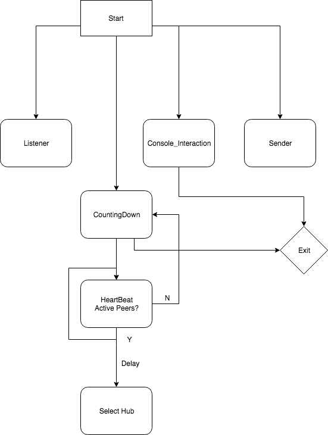

## StarNode

Weichao Chen, wchen408@gatech.edu

Grace Harper, ghaper31@gatech.edu


### Design Logic




### File Descriptions

**StarNode.py** : Definition of class StarNode


### Usage

Positional Argument: *node_name*, *local_port*, *max_node*

Optional arguments: *PoC_address*, *PoC_port*

Example without PoC:

```bash
python3 StarNode.py node2 1222 10
```

with PoC:

```bash
python3 StarNode.py node1 1111 -pa=localhost -pc=1222 10
```


### Assumption/Limitations

* The Starnode class relies on time.time() to determine the RTTSUM exchange time points within the network, which are defined to be every multiple of interval between two exchange time. If machines on which Starnode instances are ran don't have a consistent localtime, the RTTSUM exchange will be asynchronous and potentially not single hub will be recognized.
* Transfer of images/files to be finished.
* Max_node not implemented
* Python3 required